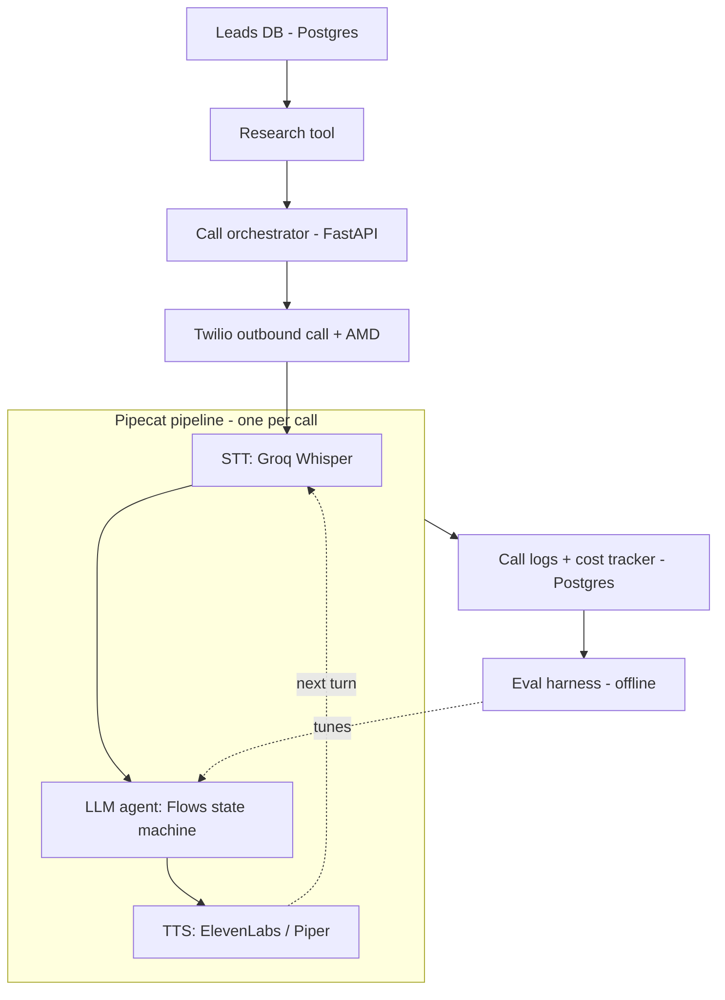
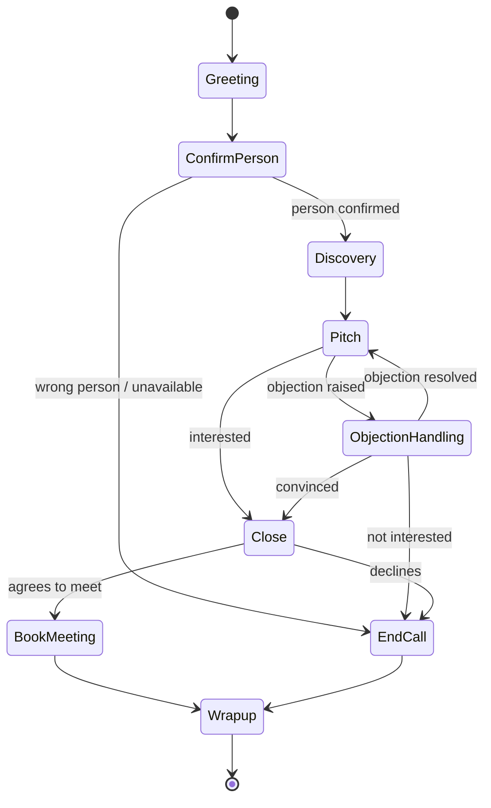
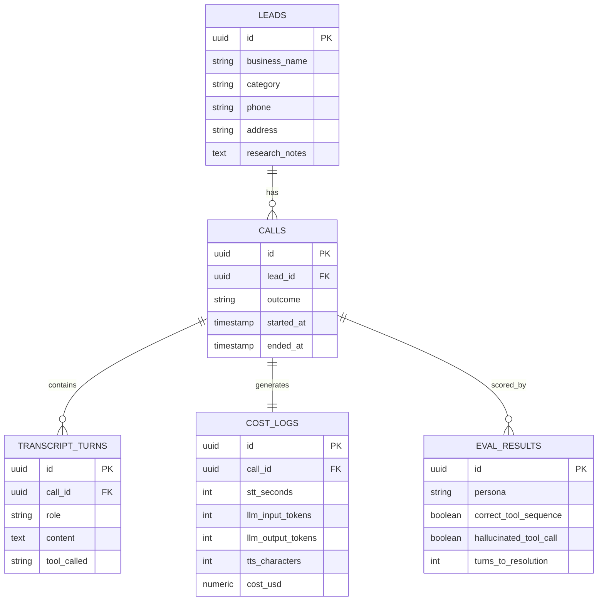

# AI Cold-Calling Voice Agent — Project Details

## 1. Overview

**What it is**: A production-grade agentic voice AI system that autonomously researches a business lead, places an outbound phone call, carries a multi-turn sales conversation, handles objections, and books a meeting (or logs the outcome) — with no human on the call.

**Origin**: Built to work through a Google Maps–sourced lead list of South Delhi businesses, where manual cold-calling wasn't scaling for the agency.

**Secondary goal**: A portfolio artifact demonstrating agent reliability engineering — explicit state machines, validated tool-calling, retry/fallback logic, cost tracking, and automated evaluation — not a LangChain chatbot demo.

**Non-goals for v1**:
- No live human handoff/transfer (escalation is logged, not executed)
- No multilingual support beyond what the chosen STT/TTS handle for Hindi-English code-switching
- No CRM integration beyond the project's own Postgres instance

---

## 2. Tech stack

| Layer | Choice | Why | Cost |
|---|---|---|---|
| Orchestration framework | Pipecat (Python) + Pipecat Flows | Open-source; handles the real-time audio pipeline and provides an explicit state-machine primitive | Free (OSS) |
| Telephony | Twilio (Voice + Media Streams + AMD) | Best Pipecat integration, trial credit, industry-standard | Free trial credit → paid for production number |
| Speech-to-text | Groq-hosted Whisper (primary), Deepgram (fallback) | Fast inference, generous free tier | Free tier |
| LLM (reasoning + tool-calling) | Groq (Llama 3.3 70B) or Gemini Flash (Google AI Studio) | Low latency, native structured function calling, free tier | Free tier |
| Text-to-speech | ElevenLabs (primary), Piper (self-hosted fallback) | Voice quality matters for how a cold call is perceived | Free tier / free (Piper) |
| Database | PostgreSQL via Neon or Supabase | Real relational modeling, no-card free tier | Free tier |
| Cache / session state | Redis via Upstash | Cross-instance coordination if scaled beyond one worker | Free tier |
| Backend/API server | FastAPI (Python) | Webhook receiver for Twilio, hosts the Pipecat pipeline | Free (self-written) |
| Hosting — development | Local machine + ngrok tunnel | Zero cost, standard workflow for voice-agent development | Free |
| Hosting — persistent | Koyeb or Google Cloud Run | No/low sleep on free tier — required since telephony webhooks need immediate responses | Free tier |
| CI/CD | GitHub Actions | Tests + lint on every PR, deploy on merge | Free |
| Observability | Arize Phoenix (OpenInference / Pipecat tracing) | Per-call trace of STT/LLM/TTS/tool spans | Free (self-host or free cloud tier) |
| Version control | GitHub | Standard | Free |

---

## 3. System architecture

---

## 4. Conversation state machine

Every arrow above is triggered by a validated tool call the LLM emits — not by the model free-form deciding when to move on. This is the core design decision that separates this from a "prompt and pray" chatbot.

---

## 5. Tool / function definitions

| Tool name | Triggered from | Purpose | Key params |
|---|---|---|---|
| `confirm_person` | ConfirmPerson | Marks whether the correct contact is on the line | `is_correct_person: bool` |
| `classify_objection` | Pitch, ObjectionHandling | Buckets the objection type | `type: enum[price, timing, not_interested, need_to_think, no_budget]` |
| `schedule_meeting` | Close | Books a follow-up slot | `date, time, contact_confirmation` |
| `mark_not_interested` | ObjectionHandling, Close | Logs a hard no | `reason` |
| `end_call` | any state | Ends the call and logs the outcome | `outcome, reason` |
| `log_voicemail` | on AMD detection | Flags voicemail, skips the conversation | — |

All tool outputs are validated against a schema (e.g. Pydantic) before the state machine accepts the transition. An invalid tool call never silently advances the conversation.

---

## 6. Data model

---

## 7. Retry & fallback logic

| Failure mode | Handling |
|---|---|
| Low ASR confidence / unclear speech | Ask the caller to repeat once, then proceed with the closest matching intent |
| Voicemail detected (Twilio AMD) | Skip the conversation, log as no-answer, schedule a retry per a backoff schedule |
| LLM returns a malformed or unknown tool call | Retry once with the validation error appended to context; if it fails again, fall back to a scripted safe line |
| LLM API timeout or outage | Fall back to the secondary LLM provider (e.g. Gemini if Groq is unavailable) |
| No response / silence timeout | Prompt once ("Are you still there?"), then end the call gracefully |
| Repeated objection loop (more than 3 cycles) | Force a transition to Close or EndCall to avoid an infinite loop |

---

## 8. Cost tracking

Per call, log: STT seconds used, LLM input/output tokens, TTS characters generated. Compute a dollar cost using each provider's published rate card and store it in `cost_logs`. Aggregate into a periodic report — average cost per call, and cost per booked meeting, which is the metric that actually matters for the agency use case.

---

## 9. Eval harness

- Build 30–50 synthetic personas: price-sensitive, uninterested, needs-time, genuinely interested, rude/hangs up abruptly.
- A second LLM plays the persona in a text-only loop against the agent's actual flow logic — audio is skipped here for speed and cost, since this is about testing decisions, not voice quality.
- Score: task completion rate, correct-tool-at-correct-state rate, hallucinated-tool-call rate, average turns to resolution.
- Run this suite on every prompt or flow change and track the score over time to catch regressions before they reach a real call.

---

## 10. Compliance notes (India)

- **TRAI DLT registration** is mandatory before running commercial outbound voice campaigns from an Indian number.
- Check numbers against the **National DNC (Do Not Disturb)** registry before calling at scale.
- These apply once the project moves off the test number — relevant starting at the deployment phase, not during development.

---

## 11. Free-tier resource summary

| Service | Free tier limit | Notes |
|---|---|---|
| Twilio | Trial credit, calls only to verified numbers | Upgrade + buy the Indian number for production |
| Groq | Generous free rate limits | Covers both STT (Whisper) and the LLM |
| Gemini (AI Studio) | Free tier, rate-limited | Fallback LLM |
| ElevenLabs | Limited free characters/month | Falls back to Piper (fully free, self-hosted) once exhausted |
| Neon / Supabase | Free Postgres; Supabase free projects pause after 7 days idle | Fine for a project of this scale |
| Upstash | Free Redis tier | Session state / coordination |
| Koyeb | Free tier, no sleep | Persistent deployment |
| Google Cloud Run | ~180k vCPU-seconds, 2M requests/month free | Alternative to Koyeb |
| GitHub Actions | Free minutes for public/student repos | CI/CD |
