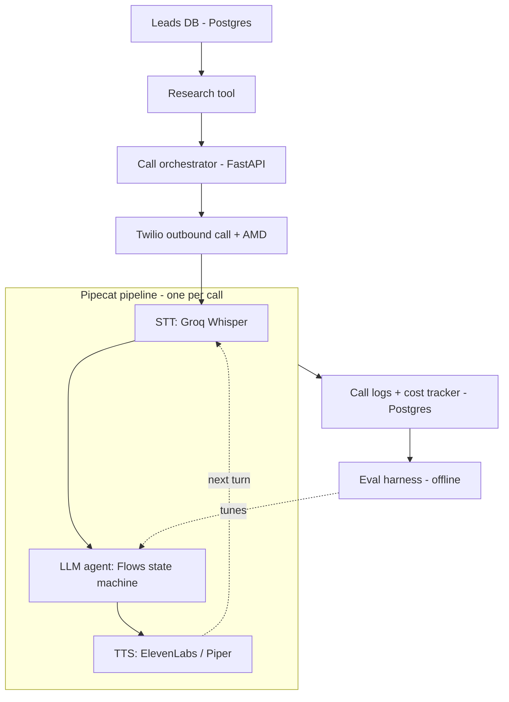

# Vox-Orchestrator: AI Cold-Calling Voice Agent

An autonomous voice AI agent that researches a business lead, places an outbound call, carries a real multi-turn sales conversation, handles objections, and books a meeting — with no human on the call.

This is not a "call an LLM and pipe it through TTS" demo. The project is built around **agent reliability**: an explicit state machine instead of a single freeform prompt, validated tool-calling instead of hoping the model does the right thing, retry/fallback logic for real-world failure modes, per-call cost tracking, and an automated evaluation harness that scores the agent against a labeled test set on every change.

**Status**: 🚧 In development — see [`phase-wise-planning.md`](./phase-wise-planning.md) for current phase.

---

## Table of contents

- [Why this exists](#why-this-exists)
- [What makes this different from a chatbot demo](#what-makes-this-different-from-a-chatbot-demo)
- [Architecture](#architecture)
- [Tech stack](#tech-stack)
- [Project structure](#project-structure)
- [Getting started](#getting-started)
- [Reliability engineering](#reliability-engineering)
- [Cost tracking](#cost-tracking)
- [Roadmap](#roadmap)
- [Compliance note](#compliance-note-india)
- [Further reading](#further-reading)
- [License](#license)

---

## Why this exists

Manually cold-calling a list of business leads one by one doesn't scale. This project automates the first call: researching the business, opening with specific context, pitching, handling common objections, and either booking a meeting or logging a clean outcome — freeing a human to only step in for the calls that actually convert.

## What makes this different from a chatbot demo

| Concern | How it's handled here |
|---|---|
| Conversation control | Explicit state machine (Pipecat Flows) — every transition is triggered by a validated tool call, not by the model deciding conversationally when to move on |
| Structured outputs | Every agent action (classify objection, book meeting, end call) is a schema-validated function call, not free text |
| Failure handling | Defined retry/fallback behavior for unclear speech, voicemail, malformed tool calls, and LLM API outages |
| Cost visibility | STT seconds, LLM tokens, and TTS characters logged per call and converted to an actual dollar figure |
| Correctness measurement | An offline eval harness runs simulated calls against labeled personas and scores task completion, tool-call accuracy, and hallucination rate on every change |

Full technical detail on each of these lives in [`project-details.md`](./project-details.md).

## Architecture



The conversation itself is modeled as an explicit state machine (Greeting → Discovery → Pitch → Objection Handling → Close → Wrap-up) — see the full state diagram in [`project-details.md`](./project-details.md#4-conversation-state-machine).

## Tech stack

| Layer | Choice |
|---|---|
| Orchestration | Pipecat + Pipecat Flows |
| Telephony | Twilio (Voice, Media Streams, AMD) |
| Speech-to-text | Groq-hosted Whisper (primary), Deepgram (fallback) |
| LLM | Groq (Llama 3.3 70B) / Gemini Flash |
| Text-to-speech | ElevenLabs (primary), Piper (fallback) |
| Database | PostgreSQL (Neon / Supabase) |
| Cache | Redis (Upstash) |
| Backend | FastAPI |
| Hosting | Local + ngrok (dev) → Koyeb / Cloud Run (persistent) |
| CI/CD | GitHub Actions |
| Observability | Arize Phoenix (Pipecat tracing) |

Full rationale and free-tier limits for each choice are in [`project-details.md`](./project-details.md#2-tech-stack).

## Project structure

```
.
├── README.md
├── project-details.md          # full technical spec
├── phase-wise-planning.md      # phase-by-phase build roadmap
├── app/
│   ├── main.py                 # FastAPI entrypoint, Twilio webhook
│   ├── pipeline/                # Pipecat pipeline + Flows state machine
│   ├── tools/                   # tool/function-call schemas and handlers
│   ├── research/                # pre-call business research/scraping
│   └── db/                      # models and queries (leads, calls, cost_logs)
├── eval/
│   ├── personas/                # synthetic caller personas
│   └── run_eval.py              # simulated-call scoring harness
└── .github/workflows/           # CI/CD
```

## Getting started

> Setup instructions will be filled in as each phase lands — see [`phase-wise-planning.md`](./phase-wise-planning.md) for what's built so far.

**Prerequisites**
- Python 3.11+
- A Twilio account (trial is fine for development; only verified numbers can be called on trial)
- API keys: Groq, Gemini, ElevenLabs
- A Postgres instance (Neon or Supabase free tier)
- A Redis instance (Upstash free tier)
- `ngrok` for local development

**Environment variables**

```
TWILIO_ACCOUNT_SID=
TWILIO_AUTH_TOKEN=
TWILIO_PHONE_NUMBER=
GROQ_API_KEY=
GEMINI_API_KEY=
ELEVENLABS_API_KEY=
DATABASE_URL=
REDIS_URL=
```

## Reliability engineering

The eval harness is the centerpiece of this project's engineering story: a second LLM plays a business-owner persona (price-sensitive, uninterested, needs time, genuinely interested, hangs up abruptly) against the agent's actual flow logic, text-only, and scores it on:

- Task completion rate (booked a meeting when it should have)
- Correct-tool-called-at-correct-state rate
- Hallucinated tool-call rate
- Average turns to resolution

This suite runs on every prompt or flow change so regressions are caught before they reach a real phone call. Details in [`project-details.md`](./project-details.md#9-eval-harness).

## Cost tracking

Every call logs STT seconds, LLM input/output tokens, and TTS characters, converted to an actual dollar cost per call using each provider's rate card — the same discipline a team running this in production would need for cost control. Schema in [`project-details.md`](./project-details.md#6-data-model).

## Roadmap

See [`phase-wise-planning.md`](./phase-wise-planning.md) for the full checklist. High level:

- [ ] Phase 0 — Environment & account setup
- [ ] Phase 1 — Pipeline skeleton
- [ ] Phase 2 — State machine (Pipecat Flows)
- [ ] Phase 3 — Business research tool
- [ ] Phase 4 — Retry & fallback logic
- [ ] Phase 5 — Data layer & cost tracking
- [ ] Phase 6 — Eval harness
- [ ] Phase 7 — Persistent deployment & production number
- [ ] Phase 8 — Stretch goals

## Compliance note (India)

This project is not registered for commercial outbound calling. Before running it against real leads at scale, it requires **TRAI DLT registration** and a check of numbers against the **National DNC (Do Not Disturb)** registry. Development and testing are done exclusively against verified test numbers.

## Further reading

- [`project-details.md`](./project-details.md) — full technical spec: architecture, state machine, tool definitions, retry logic, data model, eval design
- [`phase-wise-planning.md`](./phase-wise-planning.md) — phase-by-phase build plan with tasks and exit criteria

## License

MIT (or update as preferred once the repo is public).
